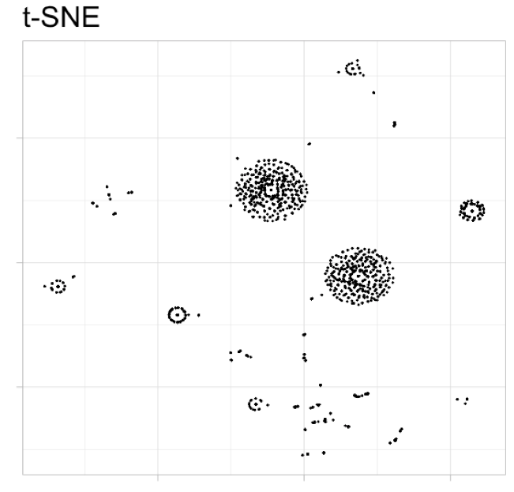
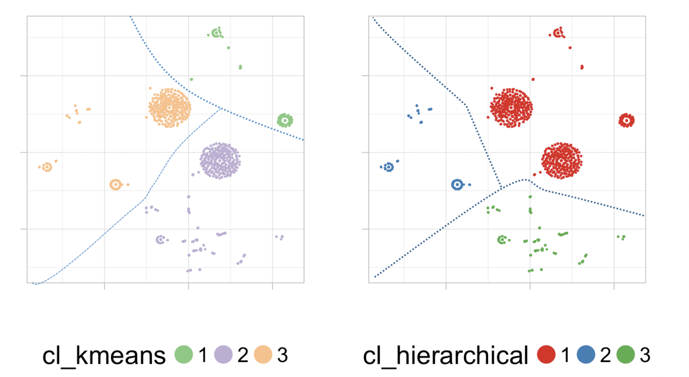
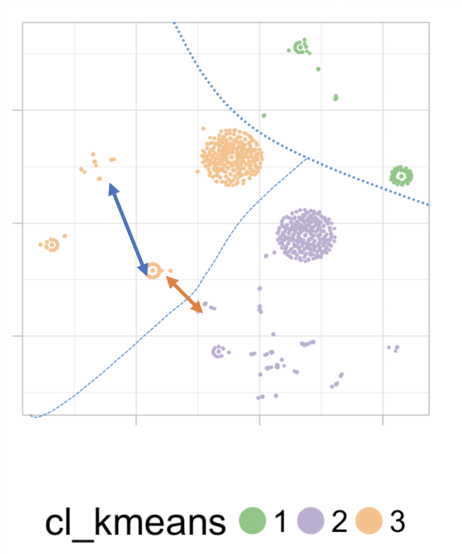
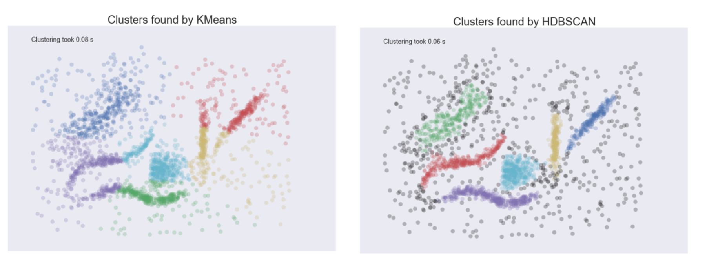

### The story

Hi there! This post is an experiment of combining the result of **t-SNE** with two well known clustering techniques: **k-means** and **hierarchical**. This will be the practical section, in **R**.

But also, this post will try to walk around the intersection point of concepts like dimension reduction, clustering analysis, data preparation, PCA, HDBSCAN, k-NN, SOM and deep learning...

<br>

### PCA and t-SNE

For those who don't know **t-SNE** technique (<a href="https://lvdmaaten.github.io/tsne/" target="blank">official site</a>), it's a projection technique -or dimension reduction- similar in some aspects to Principal Component Analysis (PCA), so we can visualize N variables into -for example- 2.

When the t-SNE output is not good, Laurens van der Maaten (t-SNA's author) says:

>  As a sanity check, try running PCA on your data to reduce it to two dimensions. If this also gives bad results, then maybe there is not very much nice structure in your data in the first place. If PCA works well but t-SNE doesn’t, I am fairly sure you did something wrong.

In my experience, doing PCA with dozens of variables with _some_ extreme values -or not normal distributions-, plus several dummy variables, doesn't lead to good visualizations.

Check this example comparing the two methods:


Source: <a href="https://www.kaggle.com/puyokw/digit-recognizer/clustering-in-2-dimension-using-tsne/code" target="blank">Clustering in 2-dimension using tsne</a>

Clear... isn't it?


<br>

### Surfing higher dimensions

Since one of the **t-SNE** results is a matrix of two dimensions, where each dot represent an input case, we can apply a clustering and then group the cases according to their distance in this **2-dimension map**. Like a geography map does with mapping 3-dimension (our world), into two (the paper).

**t-SNE** puts similar cases together, handling non-linearities in data very well. After using the algorithm on several data sets, I think in some cases it creates _sort of circular shapes_ like islands, where the input cases are similar (<a href="http://varianceexplained.org/r/kmeans-free-lunch/" target="blank">K-means clustering is not a free lunch</a>).

I tested the similarity of these cases present in the "islans", and they were effectively similar between them.

However I didn't see this effect on the live demostration from Google Brain team: <a href="http://distill.pub/2016/misread-tsne/" target="blank">How to Use t-SNE Effectively</a>. Perhaps because of the nature of input data, 2 variables as input.

<br>

#### The swiss roll data

t-SNE according to its FAQ doesn't work very well with the _swiss roll_ -toy- data. However it's an stunning example of how a 3-Dimension surface (or **manifold**) with a concrete spiral shape **is unfolded** like a paper thanks to a reducing dimension technique.

The image is taken from <a href="http://axon.cs.byu.edu/papers/gashler2011smc.pdf" target="blank">this paper</a> where they used the <a href="https://en.wikipedia.org/wiki/Nonlinear_dimensionality_reduction#Manifold_sculpting">manifold sculpting</a> technique.


<br>

### Now the practice in R!

t-SNA can helps to make the cluster more accurate because it converts data into a 2-dimension space where dots are in a circular shape (which pleases to k-means and it's one of its weak points where creating the segments [1].

Sort of **data preparation** to apply the clustering models.

```{r, eval=FALSE}
library(caret)
library(Rtsne)

######################################################################
## The WHOLE post is in: https://github.com/pablo14/post_cluster_tsne
######################################################################

## Download data from: https://github.com/pablo14/post_cluster_tsne/blob/master/data_1.txt (url path inside the gitrepo.)
data_tsne=read.delim("data_1.txt", header = T, stringsAsFactors = F, sep = "\t")

## Rtsne function may take some minutes to complete...
set.seed(9)
tsne_model_1 = Rtsne(as.matrix(data_tsne), check_duplicates=FALSE, pca=TRUE, perplexity=30, theta=0.5, dims=2)

## getting the two dimension matrix
d_tsne_1 = as.data.frame(tsne_model_1$Y)
```

Different runs of `Rtsne` lead to different results. So probably you will not see exactly the same model as the one present here.

According to the official documentation, `perplexity` is related to the importance of neighbors:

* _"It is comparable with the number of nearest neighbors k that is employed in many manifold learners."_
* _"Typical values for the perplexity range between 5 and 50"_

Object `tsne_model_1$Y` contains the X-Y coordinates (`V1` and `V2` variables) for each input case.

<br>

Plotting the t-SNE result:

```{r, eval=F}
## plotting the results without clustering
ggplot(d_tsne_1, aes(x=V1, y=V2)) +
  geom_point(size=0.25) +
  guides(colour=guide_legend(override.aes=list(size=6))) +
  xlab("") + ylab("") +
  ggtitle("t-SNE") +
  theme_light(base_size=20) +
  theme(axis.text.x=element_blank(),
        axis.text.y=element_blank()) +
  scale_colour_brewer(palette = "Set2")
```



<br>

And there are the famous "islands" 🏝️. At this point, we can do some clustering by looking at it... But let's try k-Means and hierarchical clustering instead 😄. In t-SNE's FAQ page suggest to decrease perplexity parameter to avoid this, nonetheless I didn't find a problem with this result.

<br>

#### Creating the cluster models

Next piece of code will create the **k-means** and **hierarchical** cluster models. For then assigning the cluster number (1, 2 or 3) to which each input case belong.

```{r, eval=F}
## keeping original data
d_tsne_1_original=d_tsne_1

## Creating k-means clustering model, and assigning the result to the data used to create the tsne
fit_cluster_kmeans=kmeans(scale(d_tsne_1), 3)
d_tsne_1_original$cl_kmeans = factor(fit_cluster_kmeans$cluster)

## Creating hierarchical cluster model, and assigning the result to the data used to create the tsne
fit_cluster_hierarchical=hclust(dist(scale(d_tsne_1)))

## setting 3 clusters as output
d_tsne_1_original$cl_hierarchical = factor(cutree(fit_cluster_hierarchical, k=3))
```

<br>

#### Plotting the cluster models onto t-SNE output

Now time to plot the result of each cluster model, based on the t-SNE map.

```{r, eval=F}
plot_cluster=function(data, var_cluster, palette)
{
  ggplot(data, aes_string(x="V1", y="V2", color=var_cluster)) +
  geom_point(size=0.25) +
  guides(colour=guide_legend(override.aes=list(size=6))) +
  xlab("") + ylab("") +
  ggtitle("") +
  theme_light(base_size=20) +
  theme(axis.text.x=element_blank(),
        axis.text.y=element_blank(),
        legend.direction = "horizontal",
        legend.position = "bottom",
        legend.box = "horizontal") +
    scale_colour_brewer(palette = palette)
}


plot_k=plot_cluster(d_tsne_1_original, "cl_kmeans", "Accent")
plot_h=plot_cluster(d_tsne_1_original, "cl_hierarchical", "Set1")

## and finally: putting the plots side by side with gridExtra lib...
library(gridExtra)
grid.arrange(plot_k, plot_h,  ncol=2)
```


<br>

### Visual analysis

In this case, and based only on visual analysis, hierarchical seems to have more _common sense_ than k-means. Take a look at following image:



_Note: dashed lines separating the clusters were drawn by hand_


<br>

In k-means, the distance in the points at the bottom left corner are quite close in comparison to the distance of other points inside the same cluster. But they belong to different clusters. Illustrating it:



So we've got: red arrow is shorter than blue arrow...

_Note: Different runs may lead to different groupings, if you don't see this effect in that part of the map, search it in other._

This effect doesn't happen in the hierarchical. Clusters with this model seems more even. But what do you think?

<br>

#### Biasing the analysis (cheating)

It's not fare to k-means to be compared like that. Last analysis based on the idea of **density clustering**. This technique is really cool to overcome the pitfalls of simpler methods.

**HDBSCAN** algorithm bases its process in densities. 

Find the escence of each one by looking at this picture:



For sure you understood the difference between them...

Last picture comes from <a href="http://nbviewer.jupyter.org/github/lmcinnes/hdbscan/blob/master/notebooks/Comparing%20Clustering%20Algorithms.ipynb" target="blank">Comparing Python Clustering Algorithms</a>. Yes, Python, but it's the same for R. The package is <a href="https://cran.r-project.org/web/packages/largeVis/vignettes/largeVis.html">largeVis</a>. _(Note: it has a <a href="https://github.com/elbamos/largeVis/issues/41" target="blank">error</a> when install, but will work soon)_.


<br>

### Deep learning and t-SNE

Quoting Luke Metz from a great post (<a href="https://indico.io/blog/visualizing-with-t-sne/" target="blank">Visualizing with t-SNE</a>):

<i>Recently there has been a lot of hype around the term “deep learning“. In most applications, these “deep” models can be boiled down to the composition of simple functions that embed from one high dimensional space to another. At first glance, these spaces might seem to large to think about or visualize, but techniques such as t-SNE allow us to start to understand what’s going on inside the black box. Now, instead of treating these models as black boxes, we can start to visualize and understand them.</i>

A deep comment 👏.

<br>

### Final toughts 🚀

Beyond this post, **t-SNE** has proven to be a really **great** general purpose tool to reduce dimensionality. It can be use to explore the relationships inside the data by building clusters. Or to analyze anomaly cases by inspecting the isolated points in the map.

Playing with dimensions is a key concept in data science and machine learning. Perplexity parameter is really similar to the *k* in nearest neighbors algorithm (<a href="https://en.wikipedia.org/wiki/K-nearest_neighbors_algorithm" target="blank">k-NN</a>). Mapping data into 2-dimension and then do clustering? Hmmm not new buddy: <a href="http://www.shanelynn.ie/self-organising-maps-for-customer-segmentation-using-r/" target="blank">Self-Organising Maps for Customer Segmentation</a>.

When we select best features to build a model, we're reducing the data's dimension. When we build a model, we are creating a function a function that describes the relationships in data... and so on...

Did you know the general concepts about k-NN and PCA? Well this is one more step, just plug the cables in the brain and that's it. Learning general concepts gives us the opportunity to do this kind of associations between all of these techniques. Despite comparing progrng languages, the power -in my opinion- is to have the focus on how data behave, and how these techniques are -and can be- connected 🙂.


<br>


